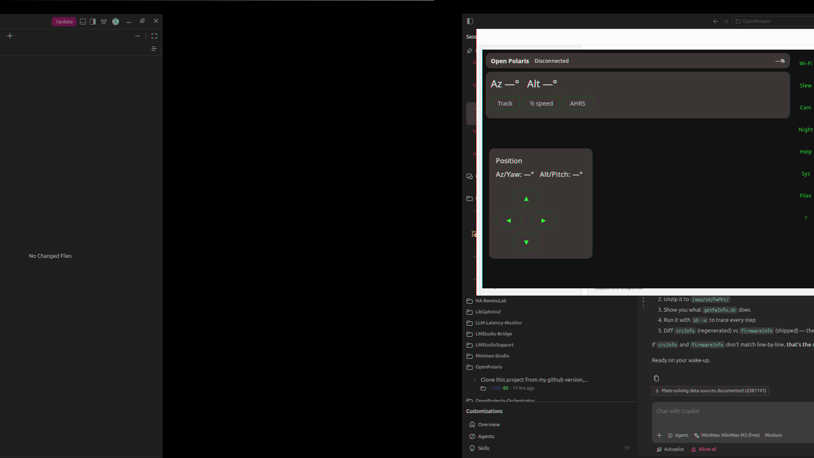

# Open Polaris — User Manual

A faithful open-source replacement for the Benro Connect app that controls the
**Benro Polaris** camera gimbal. The same on-screen layout, the same on-device
flows, no vendor lock-in.

> **Naming.** "Open Polaris" is an independent project. "Benro" and "Polaris"
> are used only to identify hardware compatibility.

> **Audience.** This manual is for a user with the Polaris gimbal and either
> the desktop build (`./gradlew :desktopApp:run`) or the Android APK
> (`androidApp/build/outputs/apk/debug/androidApp-debug.apk`). It assumes the
> gimbal is on the bench, in its `Polaris_XXXX` Wi-Fi access-point mode, and
> powered on.



## 1. Install

### 1.1 Desktop (JVM)

Pre-reqs (one-time):
- **JDK 21** (Temurin 21, pre-installed at `/home/ian/jdk/jdk-21.0.5+11`).
  Source it for every fresh shell, e.g. `export JAVA_HOME=/home/ian/jdk/jdk-21.0.5+11`.
- `ANDROID_HOME` if you intend to also build the Android APK. The repo
  ships `scripts/env.sh` that sets this to `/home/ian/android-sdk` — `source
  scripts/env.sh` in any new shell before invoking Gradle.

Run:
```
./gradlew :desktopApp:run
```

The window opens on the main screen. The title bar reads **Open Polaris**.

### 1.2 Android

Pre-reqs: Android SDK 35 platform + build-tools 34 installed under
`$ANDROID_HOME`. JDK 17+ is fine for the build (the project compiles to Java
17 bytecode).

Build a debug APK:
```
./gradlew :androidApp:assembleDebug
```

The APK lands at:
`androidApp/build/outputs/apk/debug/androidApp-debug.apk`

Sideload it with `adb install -r <path>` on a device that can talk to the
gimbal's Wi-Fi AP.

### 1.3 Verify the build (optional)

```
./gradlew :shared:jvmTest :composeApp:jvmTest
```

This runs the JVM unit tests. Android instrumentation tests are out of scope
for v1; the smoke test in §11 is the hardware gate.

## 2. First connection

### 2.1 Join the gimbal's Wi-Fi

Power on the Polaris. It broadcasts an AP whose SSID begins with `Polaris_`
(followed by the last six hex digits of the unit's serial). The **BSSID** is
printed on the device label and the password is the unit's default AP key
(sticker under the battery plate).

**Desktop:** the easiest path is the bridge button — see §3.1.
**Android:** use the system Wi-Fi picker; Open Polaris surfaces a "Connect
mount Wi-Fi…" shortcut in the Connection dialog (see §3).

### 2.2 Open the app and connect

1. Launch the app. You land on the main screen (a status strip, position
   readout, and a four-button jog pad).
2. Tap **Wi-Fi** in the callout rail — the Connection dialog opens.
3. The host defaults to `192.168.0.1` and the port to **9090**. Both are
   editable; the port field accepts a numeric value and falls back to `9090`
   on a non-numeric entry.
4. Tap **Connect**.

The status line under the buttons updates:

- `Connecting…` while the TCP socket is opening.
- `Connected` once the post-connect bootstrap (camera, tracking, capture
  polling, preview) has completed.
- A `crash: …` line if any post-connect step throws — the app then
  disconnects so the next `Connect` press is a clean retry.

The Connect button is double-tap-safe; the second tap is ignored while the
first connect is in flight.

## 3. The Connection dialog

A modal card titled **Connection**.

| Control | Effect |
|---|---|
| Mount host | Text field; the gimbal's IP (default `192.168.0.1`). |
| Port | Numeric field; default `9090`. |
| **Connect** | Opens the TCP socket and starts the post-connect bootstrap. |
| **Demo mode** | Spins up the in-process simulator — no network. |
| **Disconnect** | Tears down the session, stops the preview, shuts down the simulator. |
| **Bridge to mount Wi-Fi…** | *(Desktop only.)* One-tap bridge: wakes the gimbal over Bluetooth, brings the segregated Wi-Fi interface up with `NetworkManager`, installs a low-metric policy route so general traffic still flows, then opens the TCP socket. See §3.1. |
| **Connect mount Wi-Fi…** | *(Android only.)* Opens the system Wi-Fi picker pre-filtered to `Polaris_*` APs. |
| Status line | Last action result — `Connecting…`, `Connected`, or a failure reason. |

### 3.1 The desktop Wi-Fi bridge

The desktop build's "Bridge to mount Wi-Fi…" button drives
`BridgeOrchestrator.bridgeToMount`, which performs the full sequence the
manual would otherwise require you to run in a terminal:

1. **Wake over Bluetooth** so the gimbal will be live when its AP appears.
2. **Bring up the Wi-Fi interface** with `NetworkManager` (no `nmcli` hand
   work).
3. **Install a low-metric policy route** for the gimbal subnet so general
   traffic is unaffected.
4. **Open the TCP socket** to `192.168.0.1:9090` and run the post-connect
   bootstrap.

If your distro lacks polkit for `nmcli`, run
`scripts/install-wifi-polkit-rule.sh` once and the bridge will run unattended.

If the bridge ever fails to bring the interface up, the **Connect mount
Wi-Fi…** picker is also rendered when both callbacks are supplied — so you
can fall back to the manual path without leaving the app.

## 4. The main screen

The main screen is always visible — there is no top-level navigation.

- A **status strip** at the top: `Mode` (Manual / Tracking / Slewing / …),
  `Battery` (percent + `(charging)` flag), and the three toggle switches
  (Tracking, Half speed, AHRS). Each switch is bound to the live mount
  state; tapping it round-trips a `543` (settling-time get) or a `547`
  (dither-enabled get) over the wire so the UI never lies about what the
  mount has acknowledged.
- A **position readout** below the strip: `Az/Yaw: …°   Alt/Pitch: …°`,
  updated ~10 Hz from the wire.
- A **jog pad** centred in the rest of the screen. Four arrow buttons in a
  plus shape. **There is no stop button** — the pad sends a brief
  velocity-step command on press and lets the mount decelerate naturally.
- A **callout rail** (row on phone, column on desktop wide). Eight small
  buttons: Wi-Fi / Slew / Cam / Preview / Helpers / FW / VR / ? — each opens
  the matching dialog.

The Half-speed toggle is in **sidereal ÷2** units — what the wire's
`halfSpeed` flag actually means. Toggling it does NOT cancel an in-flight
slew.

## 5. Callout dialogs

Each callout button opens a modal card that fills the screen on a phone
and a large central area on desktop. The dialogs are independent — opening
Slew then Helpers shows the Helpers card on top.

### 5.1 Slew & Align

The "go-to" pane. From top to bottom:

- **Observer location.** Two numeric text fields, `Lat ° (N+)` and
  `Lng ° (E+)`. Required for sidereal tracking and RA/Dec slew.
- **Coordinate mode chips.** `Az/Alt` (default) or `RA/Dec`. Tap to switch;
  the entry row beneath swaps to the right format.
- **Target entry.** In Az/Alt: `Azimuth °` and `Altitude °` text fields. In
  RA/Dec: `RA (HH MM SS)` and `Dec (±DD MM SS)` text fields. Entries are
  human-formatted, not raw degrees.
- **Slew row.** `Slew` (sends the slew to the mount), `Cancel slew`
  (halts any in-flight slew), `Reset position` (clears the position cache).
- **Plate solve.** A `Solve now` button that grabs the latest preview
  frame, runs the centroid/quad solver, and (on success) nudges the mount
  to centre the entered target. The last result is shown beneath the
  button: `Last solve: RA %.4f°  Dec %.4f°  (matched=N, conf=…)`. The
  feature flag `plateSolve` must be enabled in your config.
- **Star alignment.** A two-step record: centre a bright star with the
  jog pad, tap `Record star`. Two to three stars spread across the sky
  give the best pointing model. `Reset alignment` clears the model. The
  label shows how many stars are currently recorded, e.g.
  `Star alignment (2 stars)`.
- **Auto-level.** A `Level now` button that runs the level sequence
  (read tilt, nudge mount, re-read, settle). A Switch toggles
  persistent auto-level, with the label flipping between `Enabled` and
  `Disabled / unknown`. `Refresh` re-polls the current tilt. Beneath
  the controls, a status line shows `Tilt: pitch …°  roll …°` and a
  colour-coded badge — `Level` (green) or `Tilt detected` (red) — keyed
  off `AutoLevelController.TOLERANCE_DEG`. The feature flag `autoLevel`
  must be enabled.

### 5.2 Camera

A warning banner is shown at the top in red: **"Experimental — command
codes unverified; enable only in Demo mode or after hardware validation."**

Beneath it, ten stepper rows, each with a `−` button on the left, a label
in the middle, and a `+` button on the right:

| Label | Bound to | Step |
|---|---|---|
| ISO | `CAM_GET_ISO` (258) / `CAM_SET_ISO` (259) | Index in the camera's ISO list |
| WB | `CAM_GET_WB` (260) / `CAM_SET_WB` (261) | Index in the WB list |
| Aperture | `CAM_GET_FNUM` (262) / `CAM_SET_FNUM` (263) | Index in the f-number list |
| EV | `CAM_GET_EV` (264) / `CAM_SET_EV` (265) | EV index |
| Focus | `CAM_GET_FOCUS` (270) / `CAM_SET_FOCUS` (271) | Focus index |
| Image size | `CAM_GET_IMG_SIZE` (272) / `CAM_SET_IMG_SIZE` (273) | Size index |
| Image format | `CAM_GET_IMG_FMT` (274) / `CAM_SET_IMG_FMT` (275) | Format index |
| Color | `CAM_GET_COLOR` (276) / `CAM_SET_COLOR` (277) | Colour profile index |
| Shutter | `CAM_GET_SHUTTER` (276) / `CAM_SET_SHUTTER` (277) | Shutter index |
| Capture mode | `CAM_GET_CAP_MODE` (302) / `CAM_SET_CAP_MODE` (303) | Mode index |

Below the steppers: a `Capture` button (disabled while a capture is
already in flight, with a `Busy` label next to it) and a `Refresh`
button that re-fetches all ten values.

The camera command codes are in the range **258..311** (see
[PROTOCOL.md](PROTOCOL.md)). The 5 new steppers beyond the original 5
were added after the underlying GET/SET pairs were wired into
`CommandTable` and the post-connect burst.

### 5.3 Preview

A live MJPEG stream of the camera. The pane has three states:

- **Connecting…** while the preview transport is opening (shown after
  a successful Connect, while the first frame is in flight).
- **A live frame** when at least one frame has been decoded.
- **`Stream unavailable`** when the transport has errored out — the
  reason is shown after the colon.

Beneath the frame, a small caption reminds the user which URL the
stream comes from: `http://<host>:<port>/?action=stream`. The port
shown is the live `vm.port`, not a hard-coded value — if you entered a
non-default port in the Connection dialog, the caption reflects it.

The pane is best-effort: a slow or absent stream never blocks the
control panes. Frames are dropped if they arrive later than the next
frame.

### 5.4 Astro helpers

The "Helpers" card. From top to bottom:

- **Dither.** A `−` / `+` pair around the current dither value plus a
  Refresh. Toggles the dither-enabled flag on the mount (code 547).
- **Settling time.** A `−` / `+` pair around the current settling-time
  value plus a Refresh (code 543). The unit is whatever the mount uses
  (typically tenths of a second).
- **Limits.** Read-only by default; the `limitsWrite` feature flag
  promotes them to a writable Switch.
- **Auto-level.** Same controls as the Slew pane, with a short
  explanation. Useful if you want to level without opening the Slew
  card.

If neither `advancedAstro` nor `autoLevel` is enabled in your config,
the card shows a banner explaining how to enable them and the controls
are still rendered but their actions return early with a status message.

### 5.5 Firmware update

The cross-platform FwPkt.zip upload flow. The card:

- Shows a red banner if the `firmwareUpload` feature flag is **off** —
  firmware install is destructive and gated behind an explicit config
  switch for that reason.
- Shows the picked file name and a human-readable size (`1.2 MB`,
  `542 KB`, `…`).
- Has `Pick firmware…` (opens the native file picker) and a `Clear`
  button once a file is picked.
- Has a `Reboot mount after install` Switch (default off).
- Has an `Upload` button (disabled until a file is picked and the
  feature flag is on).
- Has a `LinearProgressIndicator` bound to the live `firmwareStatus`,
  plus a short status line: `Uploading: 1.2 MB / 2.3 MB`, or
  `Installing on mount: 47%`, or `Done`, or `Failed: <reason>`.

The full state machine is:
**arm (810) → start (784) → chunks (794) → end (795) → install → poll
(811) → optional reboot (812)**. The chunk binary framing is a
placeholder pending a live Benro Connect trace — Polaris was offline
the night this was written, so the upload has been smoke-tested
end-to-end only against the simulator.

**Warning.** A bad image bricks the mount until you re-flash over USB.
Pick the right FwPkt.zip for your serial number and don't interrupt
the upload once `Installing on mount: N%` is shown.

### 5.6 VR (3D / stereo)

A barrel-distortion GL pass over the same preview. On Android, the
`VR` callout launches `VRActivity`, which sets up a `GLSurfaceView`,
the stereo shader pair, and the volume-key recenter. On desktop, the
callout is a placeholder — desktop VR headsets aren't a v1 target.

Plate-solve target markers are projected into the stereo image so
that, in a real headset, the user can see the next slew target as a
glowing cross-hair. The recenter control snaps the stereo baseline to
the current inter-pupillary distance, which is useful after a
headset re-fit.

### 5.7 Guide (`?`)

A read-only **ReadmePane** that re-renders the contents of
`README.md` and a curated subset of the docs in this folder. Tap a
link in the guide to jump to the matching section. The guide is the
in-app companion to this manual.

## 6. Feature flags

The app reads `dev.openpolaris.core.config.FeatureFlags` at startup.
The full set:

| Flag | Default | Effect when off |
|---|---|---|
| `firmwareUpload` | off | Firmware card shows a red banner; the `Upload` button is disabled. |
| `advancedAstro` | on | Helper card shows a banner; the dither/settling/limits steppers are still rendered but their actions are no-ops with a status message. |
| `autoLevel` | on | Same as above for the auto-level controls. |
| `plateSolve` | on | The `Solve now` button is rendered but its action is a no-op. |
| `limitsWrite` | off | The Limits row in the Helpers card is read-only. |
| `systemReboot` | off | The System card's Reboot / Shutdown buttons are no-ops. |
| `fileManager` | off | The Files card is rendered but its action handlers return early. |

Flip a flag by editing your config (the project ships
`app/src/commonMain/resources/openpolaris.conf` with the default
on/off values) and restarting the app. The flag values are read once
at startup.

## 7. Reconnect prompt

If you have previously connected to a mount and the app is relaunched
without an active session, a dialog asks: **"Reconnect to
`<host>:<port>`?"**. `Reconnect` calls `connect()` with the saved
values; `Dismiss` clears the prompt until the next launch. The
underlying mechanism is `SessionStore` (file-backed
`SessionMarker` JSON) — the host/port are saved on a successful
connect and cleared on a clean disconnect.

## 8. The 3D / VR view

The 3D / VR target is to let a user wearing a stereo headset see:

1. The live camera preview, with **barrel distortion** applied so the
   headset's lenses undo it and the image is geometrically correct.
2. A **plate-solve target marker** projected into 3D — a glowing
   cross-hair that hovers at the next slew target, so the user can
   confirm the slew direction without taking the headset off.
3. A **recenter** control on the volume keys, so the user can re-fit
   the headset mid-session.

The implementation lives in `androidApp/.../VRActivity.kt` and
`shared/.../VrStereoShaders.kt`. The shader pair has a unit test in
`shared/.../VrStereoShadersTest.kt`.

## 9. Troubleshooting

| Symptom | Likely cause | Fix |
|---|---|---|
| `Connect` returns `Connection refused` | Wrong host or port, or the gimbal AP isn't joined. | Tap **Connect mount Wi-Fi…** (Android) or the bridge button (desktop). |
| `Connect` returns `timeout` | The gimbal is on the tplink subnet, not the `polaris_*` AP. | Re-join the gimbal AP. From a tplink subnet, `192.168.0.1` is the AP's admin page. |
| Status line says `crash: …` after `Connected` | A post-connect step threw (camera poll, capture poll, preview start). | The app has already called `disconnect()`. Tap **Connect** again — if the symptom persists, file an issue with the crash text. |
| Preview pane says `Stream unavailable: …` | Camera is off, USB is unplugged, or the mount isn't on. | Tap **Connect** again. If preview is still down after a clean reconnect, the mount is in a state where the camera transport won't open — power-cycle the gimbal. |
| Helpers card shows a red banner | Both `advancedAstro` and `autoLevel` are off. | Edit your config and re-launch. |
| Firmware card is red and `Upload` is disabled | The `firmwareUpload` flag is off. | Edit your config and re-launch. |
| Jog pad presses do nothing | Connected but in **Slewing** mode. | Wait for the slew to complete, or tap **Cancel slew** in the Slew dialog. |
| A status line is stuck on `Connecting…` | The TCP socket hung — most often because the gimbal lost power mid-slew. | Tap **Disconnect** then **Connect**. |

## 10. Safety

- **Firmware install is destructive.** A bad image bricks the mount
  until you re-flash over USB. Pick the right FwPkt.zip for your
  serial, don't interrupt the upload, and double-check the
  `Installing on mount: N%` phase is progressing.
- **The jog pad is intentionally without a stop button.** A single
  press is a brief velocity step, not a continuous slew. The mount
  decelerates on its own.
- **The auto-level feature assumes the mount is on a stable
  surface.** Don't run it while the gimbal is being held.
- **The bridge button on desktop runs `NetworkManager` actions that
  require polkit.** If your distro doesn't grant it to your user,
  run `scripts/install-wifi-polkit-rule.sh` once and re-login.

## 11. Smoke test (hardware gate)

The `scripts/live-smoke.sh` script automates the network-state
check, the gimbal TCP reachability check, and the post-connect
pre-camera burst probe. It refuses to fire the burst unless the host
is on a `polaris_*` AP (because from the tplink subnet, `192.168.0.1`
is the TP-Link admin page, not the gimbal).

```
nmcli connection up polaris_d13e86
scripts/live-smoke.sh
```

The probe sends the canonical 9-code pre-camera burst from
`CommandTable.BURST_PRE_CAMERA` (808, 809, 802, 778, 779, 775, 824,
524, 543) and prints the parsed responses to stdout. Pass `--full`
to fire a wider catalog.

A clean run leaves the gimbal in the same state as a fresh power-on,
so the script is safe to re-run as a regression check before and
after any firmware work.

## 12. Where to next

- [PROTOCOL.md](PROTOCOL.md) — every wire code, every payload
  format, every quirk (inverted `halfSpeed`, AHRS gating, the
  `Tempa` broadcast without a colon).
- [ARCHITECTURE.md](ARCHITECTURE.md) — module layout, the
  `expect`/`actual` pattern, the test pyramid.
- [SPEC.md](SPEC.md) — the v1 acceptance criteria and the screen
  map.
- [BUILD.md](BUILD.md) — toolchain setup, including the JDK 21
  extract and the Android SDK location.
- [FIRMWARE-ANALYSIS-ALPACA.md](FIRMWARE-ANALYSIS-ALPACA.md) — how
  the protocol was derived from live captures.
- [evidence/](evidence/) — the live sweeps, the audits, the proof.

If something in the manual doesn't match the app, please file an
issue — the app is the source of truth, the manual follows.
